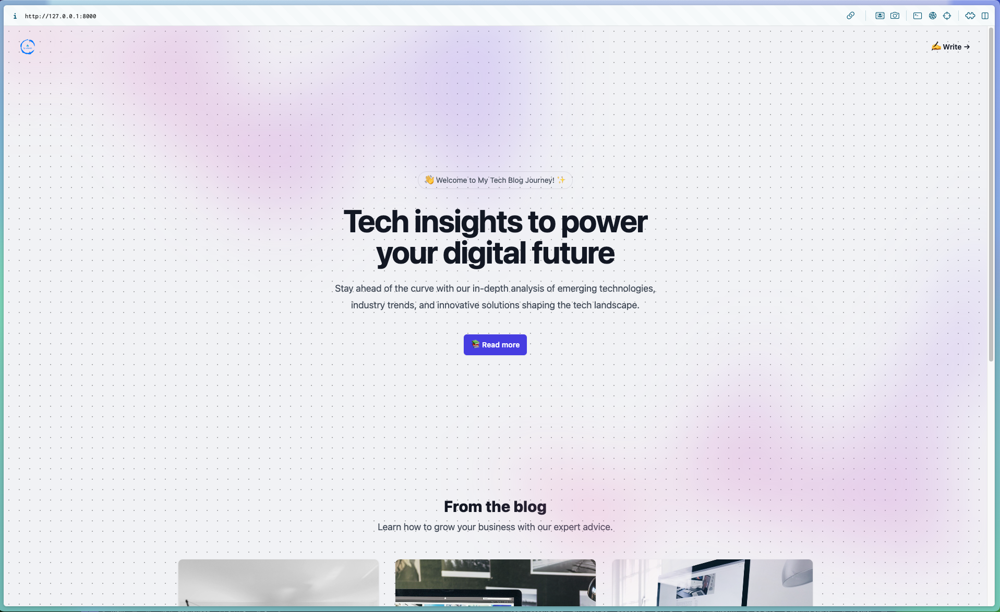

# Tech Blog mit Django 5 und TailwindCSS



Dieses Projekt ist ein Tech Blog, erstellt als Projektarbeit mit Django 5 und TailwindCSS.

## Projektbeschreibung

Dieses Tech Blog bietet eine Plattform für Technologie-Enthusiasten, um Artikel zu veröffentlichen. Es wurde mit Django 5 als Backend-Framework und TailwindCSS für das Frontend-Styling entwickelt.

## Funktionen

- Responsive Design für verschiedene Geräte
- Erstellung, Bearbeitung und Löschung von Blogbeiträgen

## Technologien

- Django 5
- TailwindCSS
- Python 3.11

## Installation

1.Klonen Sie das Repository:

```py
git clone https://github.com/DyanGao/Django_Project.git
```

2.Wechseln Sie in das Projektverzeichnis:

```py
cd myblog
```

3.Erstellen Sie eine virtuelle Umgebung und aktivieren Sie diese:

```py
-> python -m venv .venv

-> source .venv/bin/activate  
# Für Windows: 
.venv\Scripts\activate

-> npm install 
```

4.Installieren Sie die erforderlichen Pakete:

```py
pip install -r requirements.txt
```

5.Führen Sie die Migrationen aus:

```py
python manage.py migrate
```

6.Starten Sie den Entwicklungsserver:

```py
python manage.py runserver
```

## Verwendung

Nachdem Sie den Server gestartet haben, können Sie das Tech Blog unter `http://localhost:8000` in Ihrem Webbrowser aufrufen.

## Beitragen

Wenn Sie zu diesem Projekt beitragen möchten, erstellen Sie bitte einen Fork des Repositories und reichen Sie einen Pull Request ein.

## Kontakt

Projekt-Link: <https://github.com/DyanGao/Django_Project>
